# Claude Code Statusline

A single-line, color-coded status bar for [Claude Code](https://claude.com/claude-code).
Shows your working folder, the active model, context-window usage, and your 5-hour /
weekly rate limits — all with static green→amber→red segmented bars.

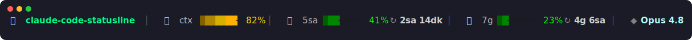

## Features

- 📁 **Working folder** — basename of the current directory
- 🧠 **Context usage** — percentage of the context window used, with a live bar
- ⏱ **5-hour rate limit** — usage + time until reset
- 📅 **Weekly (7-day) rate limit** — usage + time until reset
- ◆ **Active model** — pinned to the far right
- 🎨 **Color ramps** — green under 75%, amber at 75%+, red at 90%+
- 🪶 Zero dependencies — pure Python 3 standard library

## Install

1. Copy the script into your Claude Code config directory:

   ```bash
   curl -fsSL https://raw.githubusercontent.com/devrim-1283/claude-code-statusline/main/statusline.py \
     -o ~/.claude/statusline.py
   ```

2. Point Claude Code at it in `~/.claude/settings.json`:

   ```json
   {
     "statusLine": {
       "type": "command",
       "command": "python3 /Users/you/.claude/statusline.py"
     }
   }
   ```

3. Restart Claude Code. That's it.

## How it works

Claude Code pipes a JSON payload to the status-line command on stdin. This script
reads the following fields and renders a single line:

| Field | Used for |
| --- | --- |
| `model.display_name` | Model label |
| `workspace.current_dir` / `cwd` | Working folder |
| `context_window.used_percentage` | Context bar |
| `rate_limits.five_hour.{used_percentage,resets_at}` | 5-hour bar + reset |
| `rate_limits.seven_day.{used_percentage,resets_at}` | Weekly bar + reset |

If a field is missing it degrades gracefully (e.g. rate limits only appear after the
first API response).

## Customization

- **Bar width** — change `width=8` in `bar()`.
- **Color ramps** — edit the `GREEN`, `AMBER`, `RED` 256-color lists.
- **Thresholds** — adjust the `90` / `75` cutoffs in `ramp_for()` and `pct_color()`.
- **Language** — reset-time labels (`sa`, `dk`, `g`) and the fallback message are in
  Turkish by default; swap them in `fmt_reset()` and the `parts` block.

## Designs

Ten alternative looks live in [`designs/`](designs/). Swap any of them in by pointing
`command` at the file you like (e.g. `python3 ~/.claude/statusline.py` →
`python3 ~/.claude/designs/05-synthwave.py`). All ten read the same Claude Code JSON
schema, so they're drop-in swappable.

### 01 · Minimal Mono — quiet grayscale, emoji-free, thin `▰▱` bars
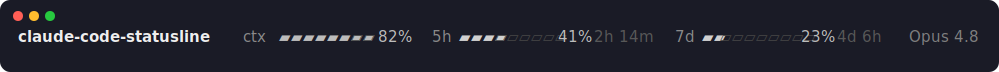

### 02 · Powerline — solid bg segments with `` arrows (needs a Powerline/Nerd Font)
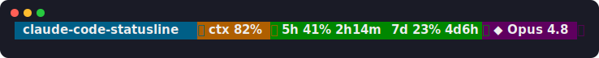

### 03 · Braille Density — ultra-compact braille dot-density bars
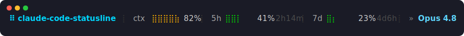

### 04 · Gradient Blocks — smooth sub-cell partial-block gradient fill
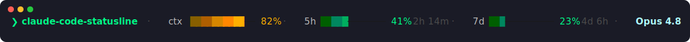

### 05 · Synthwave Neon — glowing magenta→cyan retro palette
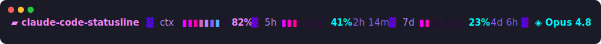

### 06 · Nerd Font — crisp dev-console glyphs instead of emoji (needs a Nerd Font)
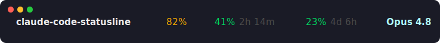

### 07 · ASCII Retro — pure ASCII `[#### ]` bars, works in any terminal
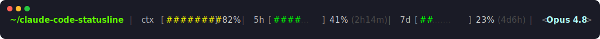

### 08 · Dot Meter — glanceable round-pip `●●●○○` meters
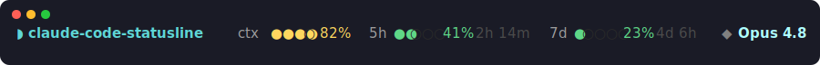

### 09 · Git Aware — **adds git branch, dirty/clean state, ahead/behind sync**
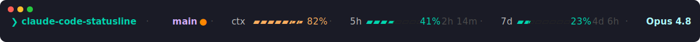

### 10 · Full Dashboard — **adds git branch, clock, token count & session $ cost estimate**
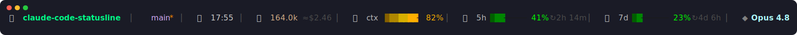

> Previews are rendered SVGs; exact glyph rendering depends on your terminal font.
> Designs 02 and 06 need a [Nerd Font](https://www.nerdfonts.com); the rest work
> with any Unicode-capable font (07 works even without Unicode).

## License

MIT © Devrim Tunçer
